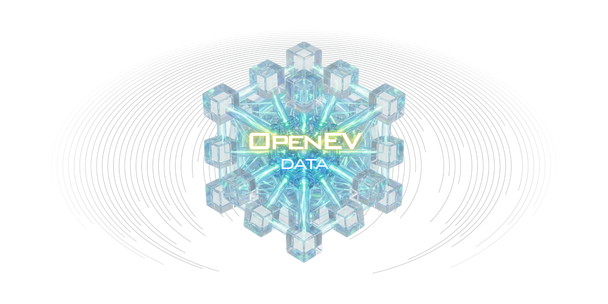

  
  <h1>OpenEV Data</h1>
  
<strong>The Single Source of Truth for Electric Vehicle Specifications.</strong>

  
  

    
    
    
    
  

---

### 🗺️ Navigation Hub

OpenEV Data is structured into modular repositories to separate data curation from engineering. Choose your destination:

| Module              | Description                                                    | Releases                                                                                                                                                             | Link                                                                   |
| :------------------ | :------------------------------------------------------------- | :------------------------------------------------------------------------------------------------------------------------------------------------------------------- | :--------------------------------------------------------------------- |
| **🏎️ Dataset**       | The core database. Download raw JSONs, schemas, and SQL dumps. |  | [**Go to Repo**](https://github.com/open-ev-data/open-ev-data-dataset) |
| **⚙️ API Engine**    | The high-performance Rust backend that serves the data.        |          | [**Go to Repo**](https://github.com/open-ev-data/open-ev-data-api)     |
| **🖥️ Web UI**       | The official web interface. Explore and compare vehicle data.  |            | [**Go to Repo**](https://github.com/open-ev-data/open-ev-data-ui)      |
| **📚 Documentation** | Integration guides, API reference, and contributing manual.    |                                                 | [**Read Docs**](https://open-ev-data.github.io)                        |
| **⚖️ Governance**    | Full project details, roadmap, and organization policies.      | -                                                                                                                                                                    | [**View Details**](../README.md)                                       |

  Powered by <strong>Rust</strong> and <strong>Community Intelligence</strong>.

